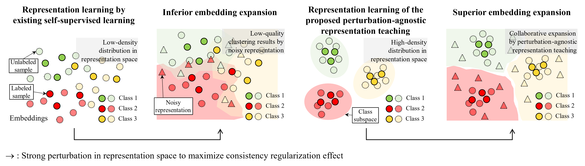

This repo provides a PyTorch implementation of ART (Adversarial Representation Teaching for Semi-supervised Learning), as described in [Here]()

# Adversarial Representation Teaching with Perturbation-agnostic Student-Teacher Structure for Semi-supervised Learning

## Graphical Abstract

The existing self-supervised learning using consistency regularization (CR) may not provide the high-density clustering result for labeled data in a representation space, which is vulnerable to strongly augmented unlabeled samples. Thus, the unlabeled data cannot be fully exploited for improving semi-supervised learning performance. To solve these, we propose a new training methodology for Student-Teacher (S-T) structure that is optimized for the labeled sample-guided representation teaching and noisy representation for CR. In our method, the adversarial attack-robust teacher model guides the student model to form a high-density distribution in representation space.
